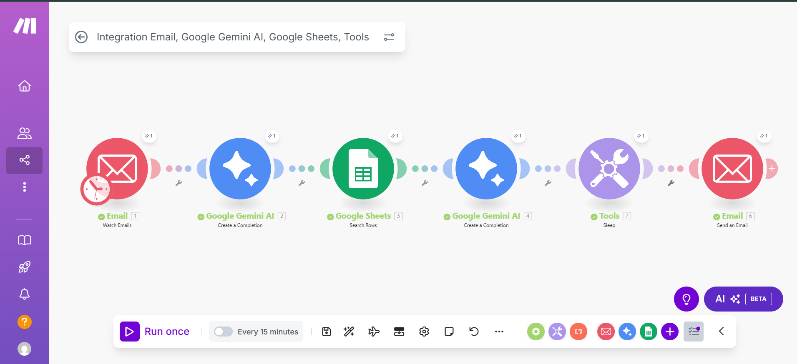

# Make.com AI Email Automation Workflow

## 📌 Overview
This repository contains a **Make.com automation workflow** that integrates:
- Gmail (incoming & outgoing emails)  
- Google Gemini AI (categorization + auto-replies)  
- Google Sheets (response templates)  

The workflow automatically categorizes incoming emails as **Sales Enquiry, Complaint, or Customer Feedback**, fetches the right template from Google Sheets, generates a polished AI response, and sends it back to the customer.

## ⚙️ Tools & Services Used
- **Make.com** – Automation platform  
- **Gmail / Email Module** – To watch and send emails  
- **Google Gemini AI** – To analyze and generate responses  
- **Google Sheets** – To store and manage response templates  

## 🛠️ Workflow Steps
1. **Email Trigger** → Watches for new unread emails.  
2. **Gemini AI Categorization** → Categorizes the email into Sales / Complaint / Feedback.  
3. **Google Sheets Lookup** → Finds the corresponding response template.  
4. **Gemini AI Generation** → Generates a final AI-enhanced reply.  
5. **Delay (Sleep)** → Prevents rapid-fire sending.  
6. **Send Email** → Sends the response back to the sender automatically.  

## 📸 Workflow Screenshot

## 🚀 How to Use
1. Import the `sanitized_scenario.blueprint.json` file into your Make.com account.  
2. Reconnect your own Gmail, Google Sheets, and Gemini AI accounts.  
3. Replace placeholder values (like `YOUR_SPREADSHEET_ID_HERE`) with your actual spreadsheet IDs.  
4. Run the scenario to test the automation.  

## 🔐 Security Notes
- All **personal emails, spreadsheet IDs, and API keys** have been removed.  
- Before running, update the workflow with your own credentials.  

## 📖 About Me
I am exploring **AI automation** with Make.com, Google Gemini AI, and workflow integrations.  
This project demonstrates how AI + automation can **streamline customer service responses**.  

👉 Connect with me on [LinkedIn](https://www.linkedin.com/in/your-profile/)  
